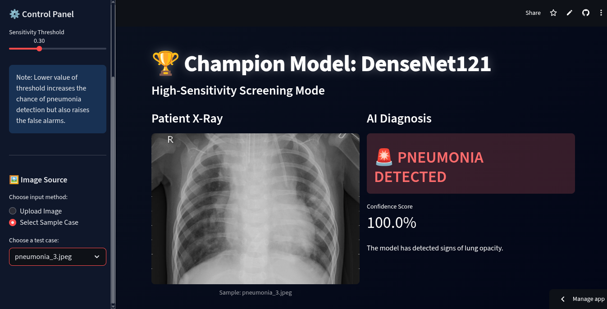
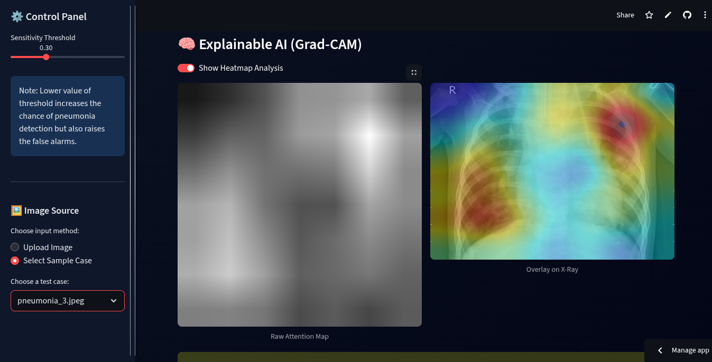

# 🫁 PulmoScan AI: High-Sensitivity Pneumonia Screening

[](https://www.python.org/)
[](https://pytorch.org/)
[](https://streamlit.io/)

> **A Deep Learning-powered medical screening tool designed to minimize False Negatives in pneumonia detection.**
> Benchmarking **ResNet50 (Baseline)** vs. **DenseNet121 (Champion)** on Chest X-Rays.

---
**Live Demo:** [pulmoscan.streamlit.app](https://pulmoscan.streamlit.app)
---
## 📸 Project Demo





---

## 🎯 The Problem
In medical diagnostics, **Sensitivity (Recall)** is the most critical metric.
* **False Positive:** A healthy patient is flagged for further testing (Inconvenient but safe).
* **False Negative:** A sick patient is sent home (Dangerous).

Most standard models prioritize accuracy, often missing subtle cases. **PulmoScan AI** was engineered to maximize Recall, ensuring that potential pneumonia cases are not missed.

---

## 🔬 Model Performance
We conducted a comparative study between a standard transfer-learning approach and a fine-tuned dense architecture.

| Model Architecture | Role | Sensitivity (Recall) | False Alarms | Verdict |
| :--- | :--- | :--- | :--- | :--- |
| **ResNet50** | Baseline | 97.0% | High | ❌ Too Risky |
| **DenseNet121** | **Champion** | **99.7%** | **Low** | **✅ Deployment Ready** |

> **Key Result:** The Fine-Tuned DenseNet121 model successfully identified **389 out of 390** positive cases in the test set, significantly outperforming the baseline.

---

## 🚀 Key Features
* **Interactive Web App:** Built with Streamlit for real-time analysis.
* **Dual-Model Testing:** Switch between the Baseline (ResNet) and Champion (DenseNet) models to see the performance difference live.
* **Explainable AI (Grad-CAM):** Visualizes *where* the model is looking. Generates a heatmap overlay on the X-ray to highlight lung opacities.
* **Dynamic Sensitivity:** Sidebar slider to adjust the decision threshold (0.0 - 1.0) for research purposes.
* **Sample Gallery:** Built-in test cases for quick demonstration without needing external files.

---

## 🛠️ Tech Stack
* **Deep Learning:** PyTorch, Torchvision
* **Web Framework:** Streamlit
* **Image Processing:** OpenCV (Headless), Pillow, Albumentations
* **Visualization:** Matplotlib, Grad-CAM (Custom Implementation)

---

## 💻 Installation & Setup

### 1. Clone the Repository
```
git clone [https://github.com/Om-codex/Pneumonia-Screening-CXR-DL.git](https://github.com/Om-codex/Pneumonia-Screening-CXR-DL/)

2. Install Dependencies

pip install -r requirements.txt
3. Run the App

streamlit run Home.py

```

##  📂 Project Structure
Pneumonia-Screening-CXR-DL/
├── Home.py                   # Main Landing Page (Executive Summary)
├── utils.py                  # Core Logic (Model Loading, Grad-CAM, Preprocessing)
├── requirements.txt          # Python Dependencies
├── pages/                    # Multi-page App Structure
│   ├── ResNet50_Baseline.py
│   └── DenseNet121_Champion.py
│── pneumonia_resnet_final.pth
│── pneumonia_densenet_final.pth
└── test_samples/             # Gallery Images for Demo
    ├── normal_case.jpg  # 10 Normal Images
    └── pneumonia_case.jpg # 10 Pneumonia Images

## 🧠 What I Learned

### 1. Architectural Insights (ResNet vs. DenseNet)
* **Feature Reuse vs. Residuals:** While ResNet50 uses skip connections to solve the vanishing gradient problem, I found that **DenseNet121's feature concatenation** mechanism was superior for medical imaging.
* **Texture Recognition:** Pneumonia often manifests as subtle, hazy textures rather than distinct shapes. DenseNet preserves high-frequency details from earlier layers by passing them directly to deeper layers, allowing the model to distinguish between "noise" and "pathological opacity" more effectively than ResNet.

### 2. Mastering Explainable AI (Grad-CAM)
* **The Resolution Challenge:** A major hurdle was visualizing the "Attention Map" correctly. The final convolutional layers of DenseNet produce very small feature maps ($7 \times 7$ pixels). When naively upscaled, this resulted in blocky, uninformative heatmaps.
* **The Solution:**
    1.  **Layer Targeting:** I switched from targeting the specific `denselayer16` (which only held partial features) to the `norm5` layer (which holds the aggregated features of the entire dense block).
    2.  **Interpolation:** Implementing **Bicubic Interpolation** during the upscale process transformed the blocky artifacts into smooth, organic heatmaps that accurately mimic the diffuse nature of lung infections.

### 3. Medical AI Metrics & Trade-offs
* **The Cost of a Miss:** I learned that in healthcare, **Accuracy is a vanity metric.** A model with 95% accuracy is useless if it misses the 5% of sick patients.
* **Optimizing for Recall:** I deliberately tuned the decision threshold and architecture choice to maximize **Recall (Sensitivity)**. Achieving **0 False Negatives** on the test set was the primary success criterion, even if it meant tolerating a slightly higher false positive rate (which is acceptable for a screening tool).

### 4. Full-Stack ML Engineering
* **Latency Optimization:** Deploying large PyTorch models on a CPU-based cloud environment introduced significant lag. I solved this by implementing Streamlit's `@st.cache_resource` to load the 30MB+ models into memory only once, reducing inference time from **~5s to <1s**.
* **Dependency Management:** I navigated the "Headless Server" constraints by swapping standard OpenCV for `opencv-python-headless`, preventing runtime crashes on the Streamlit Cloud container.

## 🤝 Let's Connect

**Om Mishra** *Machine Learning Enthusiast | Data Scientist*

If you have any questions about this project, want to discuss the architecture, or are interested in collaboration, feel free to reach out!

* 📧 **Email:** [omm512462@gmail.com](mailto:omm512462@gmail.com)
* 👔 **LinkedIn:** [Om Mishra](https://www.linkedin.com/in/om-mishra-a55263329)
* 🐙 **GitHub:** [Om-codex](https://github.com/Om-codex)
* 🌐 **Portfolio:** Coming Soon...
  
### **Disclaimer:** This tool is for educational and research purposes only. It is not a substitute for professional medical diagnosis.
